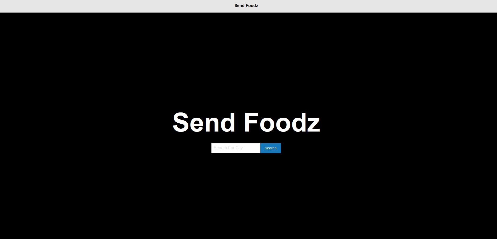

# send-foodz-proposal
- "Send Foodz" is an application that will allow for the user to click a button and generate a random restaurant based on the city location that the user chooses.  
- The CSS Framework that will be used is Materialized.
- Feeling Hungry? Check out “Send Foodz” 

## User Story
- Who is your audience? 
    - "Send Foodz" is perfect for those who do not know what they want to eat and for those who want to try out new cuisine.
- What is the problem that the product will address?
    - "Send Foodz" will help people to try new places and help them decide where to eat.
- How does the product solve that problem? 
    - "Send Foodz" solves this problem by randomly generating a restaurant for the user at a click of a button, while allowing for them to find a restaurant near their city of choice. 

## APIs to be used
- Yelp 
- Google Maps

## How "Send Foodz" Works 
- The user visits the landing page, where they will be presented with a search bar where the user can input their city.
- Then the user can click a button that will display a random restaurant near the city that was inputted. 

## Goals 
### Phase 01
- Outline basic structure of webpage with HTML and CSS using materialize. 
- Apply API keys and make sure button works. 
### Phase 02
- Show restaurant/city on webpage.
### Phase 03 (BONUS)
- Add michelin star restaurants. 
- Add food categories.

## Project Outline Screenshot 
